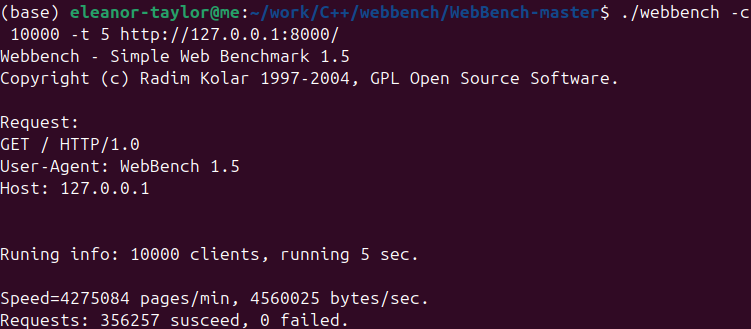

# README
C++实现的高性能网络库及http服务器
--------------------

本项目是基于C++17（主要是C++11）编写的webserver。  
实现了一个以事件驱动为核心的非阻塞小型网络库。  
在网络库基础上实现了http服务器和websocket服务器，实现了用户注册、登陆、注销及网页用户信息动态更新等功能。

**Method**
----------

http服务器部分基于网络库，大部分自主编写；sql连接池、http测试、websocket相关内容及用到的网页资源皆自主编写。

网络库部分主要参考muduo库结构，方法如下。

在编写中有时会阅读源码和笔记，但是阅读和编写至少隔一天，因为印象记忆可能阻碍理解：

*   第N天，细看接下来要编写的部分，做笔记，不刻意记忆，防止编写时照着印象抄，阻碍思考和深入理解。
*   第N+1天，在留存的模糊印象基础上，结合自己的理解**编写**代码，记录遇到的疑惑和问题。确定无法继续编写之前，不再看对应部分的源码和笔记。

在修正代码时，也遵循类似的方法：

*   第N天，如果确定自己写不下去了，尽量当天**对比**源码和自己编写内容，记录自己编写的代码的错误、和源码相比缺失的功能，以及回答编写时的问题。这一天不再编写对应内容。
*   第N+1天，尝试改正比较过的代码，期间不再看对应的源码或笔记。对于存在的错误，尝试改正；对于仅与源码不一致的部分，只有存在明确理由才修改（以便在测试中暴露不足，理解源码意图）；对于缺失的功能不急着加，编写其它部分时意识到这一功能的必要性后再自然地补上。

阅读、编写和对比叠加进行，在编写和对比当天如果有时间剩余，则阅读其它部分源码，并在第二天继续修正、编写、阅读未编写部分代码。代码编写的部分记录见[记录](README/%E8%AE%B0%E5%BD%95.md)和[遇到的部分问题](README/%E9%81%87%E5%88%B0%E7%9A%84%E9%83%A8%E5%88%86%E9%97%AE%E9%A2%98)（从trilium笔记导出）。大部分内容都存在commit记录。

由于之前没有类似的经验，方法也是在编写过程中逐渐确定的，所以前半部分记录较为简略，部分内容（主要是logging、time等基础部分内容）未记录，记录与上述方法并不严格一致（如可能因为编写当天时间不够，和源码的比较在第二天才开始）。

**Technical points**
--------------------

*   通过constexpr修饰模板函数在编译时精确计算不同类型format最大长度，减小运行时开销。
*   采用异步logging方式，使用后备buffer，允许短时间大量日志写入。
*   采用Epoll进行事件轮询，LT触发方式，兼顾效率与容错性。
*   借助EventLoop循环管理各事件回调，有良好的单线程抽象，避免锁的大量使用。
*   采用Round-Robin算法实现负载均衡。
*   Connector自动重连，增强客户端连接的鲁棒性。
*   Acceptor进行事件监听时创建占位socket，保证文件描述符不足时也能响应连接（关闭连接）。
*   缓存进程pid、线程tid等参数，节省系统调用，并通过分支预测优化性能。
*   采用仅关闭写端的方式断开连接，防止消息丢失。
*   采用智能指针管理对象生命周期，通过bind回调传入智能指针延长相关对象生命周期，防止意外析构。
*   sql连接、redis连接、互斥锁等设施采用RAII的封装方式，简化API调用。
*   通过context提供可存储在连接中的上下文信息。
*   通过有限状态机实现了http请求和响应的不同传输方式解析、websocket的帧解析。
*   通过OpenSSL和http请求响应实现了websocket的握手机制。
*   http测试部分实现了注册、登陆、注销、用户信息动态更新等功能，能够正常加载多媒体资源。websocket测试部分实现了客户端和服务端的正常通信。

**Demonstrate**
---------------

http功能演示：  
[功能演示.mp4](README/README_功能演示.mp4) 

压力测试：  


🔥火焰图：  

<!-- [火焰图.svg](README/火焰图.svg) -->

**Environment**
---------------

在Ubuntu24.04 LTS上编写  
CMake版本3.10  
g++版本13.3.0  
mysql版本8.0.42  
redis版本7.0.15  
openssl版本3.4.1  
c++17

**Usage**
---------

```text-plain
sudo apt install g++ cmake make
sudo apt install -y mysql-server-8.0#安装mysql
sudo mysql -uroot -p -e "
CREATE USER IF NOT EXISTS 'test_http'@'localhost' IDENTIFIED BY '123456';
CREATE DATABASE IF NOT EXISTS test_http_database;
GRANT ALL PRIVILEGES ON test_http_database.* TO 'test_http'@'localhost';
"#创建用户、添加数据库、授权
```

然后打开项目目录，编译并运行生成的可执行文件testProgram，如果没有错误信息，打开浏览器访问127.0.0.1:8000即可连接到测试服务。

**Content**
-----------

编写的大致顺序是自底层向上层的。

基础部分在mybase目录下，包括：common/    process/    time/    logging/，顺序：  
patterns、format  
logStream

stringArg、fileUtil  
currentThread、currentProcess  
timeStamp、date  
mutexLock、logFile、logger

condition、countDownLatch  
threadHandler、threadPool  
asyncLogging

connectionPool  

网络库部分在mynetlib目录下，包括：event/    poller/    net/    http/，顺序：  
socket、inetAddress  
timer、timerQueue、channel、poller  
eventLoop、epollPoller  
eventThread、eventThreadPool  
acceptor、connector  
connBuffer、tcpConnection、tcpServer、tcpClient  

服务器部分在mywebserver目录下，包括：mysql/    redis/    http/    websocket/，顺序：  
sqlConnectionPool、sqlConnectionGuard  
redisConnectionPool、redisConnectionGuard  
contextMap、httpRequest、httpResponse、httpParser、httpServer  
webSocket、webSocketHandshake、webSocketFrame、webSocketParser、webSocketServer

最后是websocket和http测试：  
http测试在mywebserver/test/httpServerTest.cpp中，相关测试资源在myWebServer/test/testResource/目录下。  
websocket测试在mywebserver/test/webSocketServerTest.cpp中。

**Further study**
-----------------

编写时对以下视角关注较少，有时间时可以发掘一下：  
——提供的接口有没有什么原则？完备性？  
——代码风格？函数命名？注释方式？（形式化一下？）  
——保证对象生命周期的方法？哪些对象需要保证生命周期？  
——线程安全注解？是什么以及如何使用？ -> [线程安全注解](README/线程安全注解.md)  
——CMakeList的测试单元？规范一下测试方式？ -> 无法应对复杂情况  
——LOG风格？LOG分级该如何选择？如何让LOG看起来更清晰？定制一种特定LOG格式？善用各种符号？ -> [LOG风格](README/Log风格.md)  
——试着使用Clang编译能够更好保证安全性？ -> 完成  
——记录状态的成员变量是如何简化多线程并发编程的？如何进行形式化的分析？  

有一些尚可扩展的内容：  
——tcpInfo信息的获取和打印  
——时区文件读取及时区设置  
——poll的轮询方式  
——异步io，io\_uring  
——不同的触发方式，边缘触发  
——可以用redis来存储用户登陆的会话信息 -> 完成  
