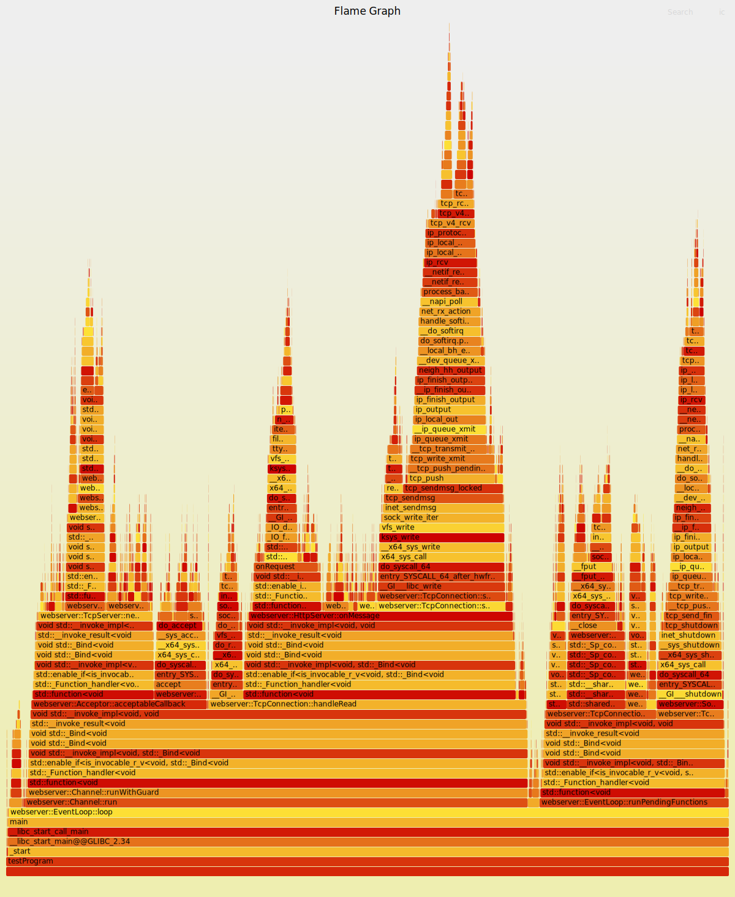
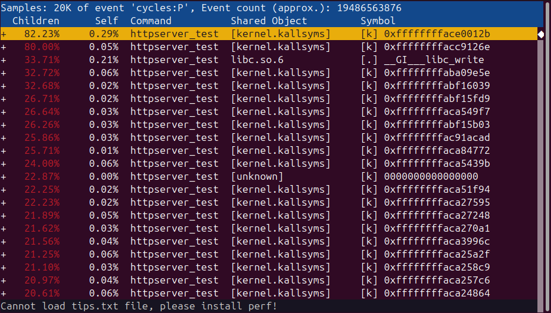

# 压力测试结果差
在用webbench对http服务器进行压力测试时，发现结果较差，webbench -c 1000 -t 5情况下和muduo库的对比如下：

|     |     |     |     |
| --- | --- | --- | --- |
| 主线程之外的线程数 | muduo（QPS） | webserver（QPS） | 增加线程增幅 |
| 0   | 141228/5 | 73055/5 | 0   |
| 1   | 151875/5 | 116482/5 | 10647/5-43427/5 |
| 2   | 260864/5 | 202671/5 | 108989/5-86189/5 |
| 3   | 328936/5 | 244643/5 | 68072/5-41972/5 |
| 4   | 377201/5 | 232825/5 | 48265/5-\-11818/5 |
| 6   | 385353/5 | 217620/5 |     |

在不开额外线程时差距很大。是不是说明我的非io线程（baseLoop）也有较大负载？

对比muduo库源码，将request的堆上创建和修改改为muduo库的传入形式后，没有明显改进。把一些内容放进cpp文件后，也没有明显改进。是程序逻辑有问题?

|     |     |     |
| --- | --- | --- |
| 主线程之外的线程数 | webserver（之前）（QPS） | webserver（之后）（QPS） |
| 0   | 73055/5 | 72747/5 |
| 1   | 116482/5 | 120494/5 |
| 2   | 202671/5 | 200079/5 |
| 3   | 244643/5 | 247501/5 |
| 4   | 232825/5 | 232667/5 |

准备用perf绘制火焰图对比看看哪里有问题，

webserver绘制的火焰图

发现muduo库加载了符号表之后还是很多函数看不出名字。

muduo库运行http测试结果

遂看了muduo的CMakeList.txt，发现启用了-O2的优化等级，改成不优化之后，性能相差不大。

|     |     |     |
| --- | --- | --- |
| 主线程之外的线程数 | webserver（QPS） | muduo不开启优化（QPS） |
| 0   | 73055/5 | 75408/5 |
| 1   | 116482/5 | 102203/5 |
| 2   | 202671/5 | 179713/5 |
| 3   | 244643/5 | 238663/5 |
| 4   | 232825/5 | 274527/5 |
| 6   | 217620/5 | 238588/5 |